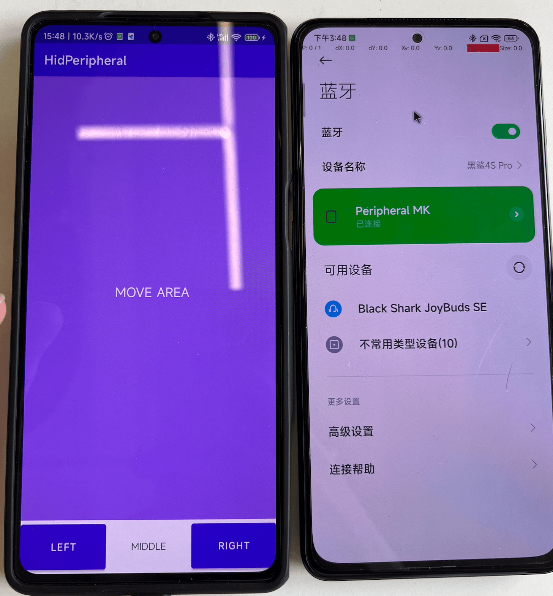
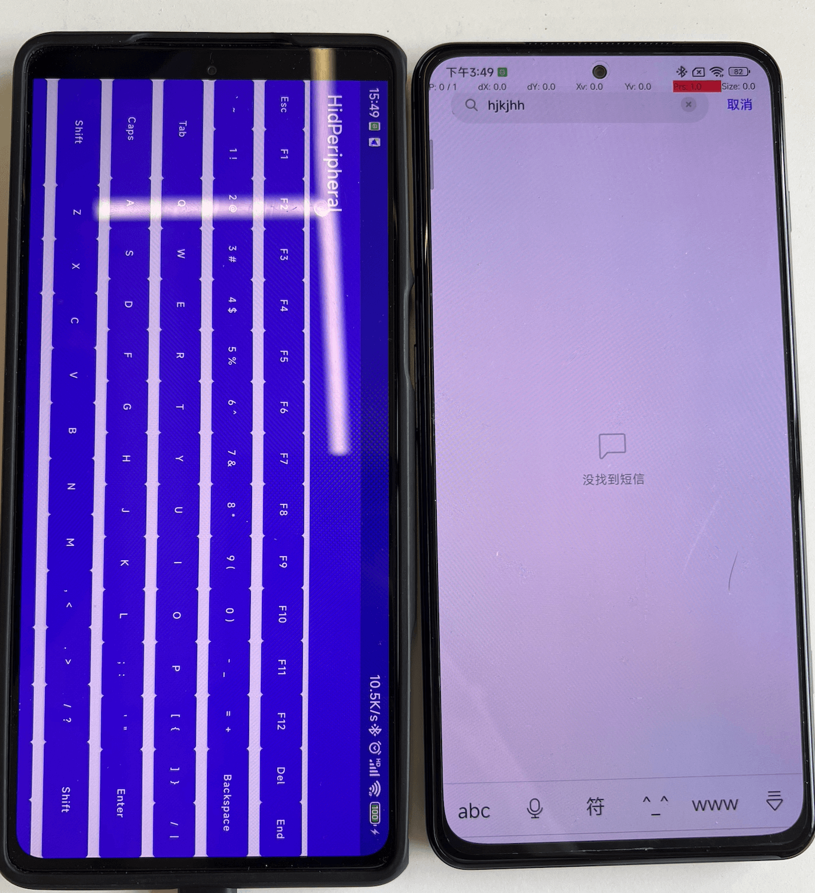
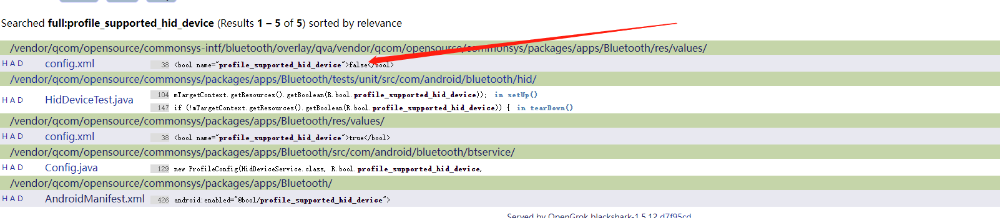

# HidPeripheral
> Simulation Bluetooth HID Device(Mouse/Keyboard) for Android，Support 「Android、iOS、Windows...」 

### Register HID Device

```java
BluetoothAdapter bluetoothAdapter = BluetoothAdapter.getDefaultAdapter();
bluetoothAdapter.getProfileProxy(context, mProfileServiceListener, BluetoothProfile.HID_DEVICE);

// SUBCLASS1_COMBO = MOUSE+KEYBOARD
BluetoothHidDeviceAppSdpSettings sdp = new BluetoothHidDeviceAppSdpSettings(HidConsts.NAME, HidConsts.DESCRIPTION, HidConsts.PROVIDER, BluetoothHidDevice.SUBCLASS1_COMBO, HidConsts.Descriptor);
mHidDevice.registerApp(sdp, null, null, Executors.newCachedThreadPool(), mCallback);
```

### iOS Device(Need to open the AssistiveTouch)
System Setting -> Accessibility -> Touch -> AssistiveTouch

### Screenshots



### Notice
In the process of my use, I found that there are some models cannot connect properly, and this situation needs to modify the corresponding configuration file in the Android system diagram.



